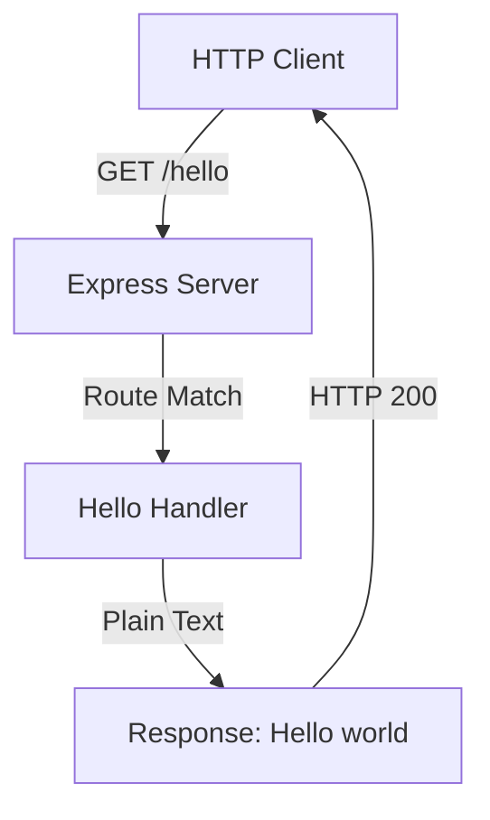

# Technical Specification

# 0. Agent Action Plan

## 0.1 Intent Clarification

### 0.1.1 Core Feature Objective

Based on the prompt, the Blitzy platform understands that the new feature requirement is to create a complete Node.js tutorial project from scratch with the following objectives:

- **Primary Objective**: Build a minimal, educational Node.js web application that demonstrates fundamental server-side JavaScript concepts
- **Endpoint Requirement**: Implement a single HTTP GET endpoint at the path `/hello` that responds with the plain text message "Hello world"
- **Target Audience**: Developers learning Node.js fundamentals, suitable as a reference tutorial project
- **Project Nature**: This is a greenfield "New Product" creation with no existing codebase to build upon (repository contains only a placeholder README.md)

**Implicit Requirements Detected**:
- The project needs proper npm initialization with a `package.json` file
- A web framework is needed to handle HTTP routing cleanly (Express.js recommended per industry standards)
- The project should follow tutorial-appropriate conventions with clear, readable code
- Basic documentation explaining how to run and test the endpoint
- Standard Node.js project structure suitable for beginners

**Feature Dependencies and Prerequisites**:
- Node.js runtime (v18.x or higher required for modern Express.js support)
- npm package manager for dependency management
- Express.js framework for HTTP server functionality

### 0.1.2 Special Instructions and Constraints

**Architectural Requirements**:
- Follow Express.js conventions for route handling
- Use minimal dependencies to keep the tutorial focused and understandable
- Structure the project for clarity and educational value

**Tutorial-Appropriate Conventions**:
- Clear, well-commented code that explains each concept
- Single-file entry point for simplicity
- Standard npm scripts for common operations (start, test)

**User Example (as specified)**:
- Endpoint: `/hello`
- Response: `"Hello world"`
- HTTP Method: GET (standard for retrieval operations)

**Web Search Requirements Conducted**:
- Best practices for Express.js "Hello World" implementations
- Current Express.js version compatibility (v5.2.1 latest, v5.x now default on npm)
- Node.js LTS version recommendations (v20.x Active LTS, v22.x Active LTS, v24.x newly LTS)

### 0.1.3 Technical Interpretation

These feature requirements translate to the following technical implementation strategy:

- **To create the project foundation**, we will initialize a new npm project with `package.json` containing appropriate metadata, scripts, and dependencies
- **To implement HTTP server functionality**, we will install Express.js v5.x as the primary dependency and create a minimal server entry point
- **To implement the `/hello` endpoint**, we will create a GET route handler using Express.js router that returns "Hello world" as plain text
- **To enable project execution**, we will configure npm start script to launch the server on a configurable port (defaulting to 3000)
- **To document usage**, we will update the README.md with clear instructions for installation, running, and testing the endpoint
- **To ensure code quality**, we will include basic ESLint configuration for consistent JavaScript style (optional but recommended for tutorials)

## 0.2 Repository Scope Discovery

### 0.2.1 Comprehensive File Analysis

**Current Repository State**:
The repository is effectively empty, containing only a placeholder file:
- `README.md` - Contains only the header "# Jan5_1"

**Search Patterns Applied** (all returning minimal or no results due to greenfield nature):
- Existing modules: `src/**/*.js`, `lib/**/*.js`, `app/**/*.js` - None found
- Test files: `**/*test*.js`, `**/*spec*.js`, `test/**/*` - None found
- Configuration files: `**/*.config.*`, `**/*.json`, `**/*.yaml` - None found
- Documentation: `**/*.md` - Only README.md found
- Build/deployment: `Dockerfile*`, `docker-compose*`, `.github/workflows/*` - None found

**Integration Point Discovery**:
As a new product creation, there are no existing integration points. The project will establish:
- HTTP endpoint at `/hello` (new)
- Express.js application instance (new)
- npm package configuration (new)

### 0.2.2 Web Search Research Conducted

| Research Topic | Findings |
|----------------|----------|
| Express.js Hello World patterns | Standard pattern uses `app.get('/path', (req, res) => {...})` with `res.send()` for responses |
| Library recommendations | Express.js v5.x is now stable and default on npm; requires Node.js 18+ |
| Common patterns | Single `app.js` or `index.js` entry point is standard for simple tutorials |
| Security considerations | Express v5.x includes ReDoS mitigation in path routing; modern async error handling |

### 0.2.3 New File Requirements

**New Source Files to Create**:

| File Path | Purpose |
|-----------|---------|
| `src/index.js` | Main application entry point; initializes Express server and defines routes |
| `src/routes/hello.js` | Route handler module for the `/hello` endpoint (optional modular approach) |

**New Configuration Files to Create**:

| File Path | Purpose |
|-----------|---------|
| `package.json` | npm project manifest with dependencies, scripts, and metadata |
| `.nvmrc` | Node version specification for consistent development environments |
| `.gitignore` | Standard ignores for Node.js projects (node_modules, logs, etc.) |

**New Documentation Files to Create/Modify**:

| File Path | Purpose |
|-----------|---------|
| `README.md` | Complete project documentation with setup, usage, and API reference |

**New Test Files to Create** (recommended for completeness):

| File Path | Purpose |
|-----------|---------|
| `tests/hello.test.js` | Unit/integration tests for the `/hello` endpoint |

### 0.2.4 Files Requiring Modification

| File Path | Modification Type | Description |
|-----------|------------------|-------------|
| `README.md` | REPLACE | Replace placeholder content with comprehensive tutorial documentation |

### 0.2.5 Repository Structure After Implementation

```
project-root/
├── src/
│   └── index.js           # Main Express application
├── tests/
│   └── hello.test.js      # Endpoint tests (optional)
├── .gitignore             # Git ignore patterns
├── .nvmrc                  # Node version specification
├── package.json           # npm configuration
└── README.md              # Project documentation
```

## 0.3 Dependency Inventory

### 0.3.1 Private and Public Packages

**Production Dependencies**:

| Registry | Package Name | Version | Purpose |
|----------|--------------|---------|---------|
| npm | express | ^5.0.1 | Minimal, flexible web framework for Node.js; handles HTTP routing and middleware |

**Development Dependencies** (recommended for tutorial completeness):

| Registry | Package Name | Version | Purpose |
|----------|--------------|---------|---------|
| npm | jest | ^29.7.0 | JavaScript testing framework for unit/integration tests |
| npm | supertest | ^7.0.0 | HTTP assertions library for testing Express endpoints |

### 0.3.2 Runtime Requirements

| Runtime | Version | Rationale |
|---------|---------|-----------|
| Node.js | >=18.0.0 | Required minimum for Express.js v5.x; current environment has v20.19.6 (Active LTS) |
| npm | >=9.0.0 | Modern npm for reliable dependency resolution; current environment has v11.1.0 |

### 0.3.3 Dependency Updates

**Import Requirements for New Files**:

The following import patterns will be used:

```javascript
// src/index.js - Express import
const express = require('express');
```

**No Existing Import Updates Required**:
As this is a greenfield project, there are no existing files requiring import modifications.

### 0.3.4 External Reference Configuration

**package.json Configuration**:

```json
{
  "name": "nodejs-hello-world-tutorial",
  "version": "1.0.0",
  "description": "A Node.js tutorial project featuring a /hello endpoint",
  "main": "src/index.js",
  "scripts": {
    "start": "node src/index.js",
    "test": "jest"
  },
  "engines": {
    "node": ">=18.0.0"
  },
  "dependencies": {
    "express": "^5.0.1"
  },
  "devDependencies": {
    "jest": "^29.7.0",
    "supertest": "^7.0.0"
  }
}
```

### 0.3.5 Version Compatibility Matrix

| Component | Minimum Version | Recommended Version | Maximum Tested |
|-----------|-----------------|---------------------|----------------|
| Node.js | 18.0.0 | 20.19.6 (LTS) | 24.x (LTS) |
| Express.js | 5.0.0 | 5.0.1 | 5.2.1 |
| npm | 9.0.0 | 11.1.0 | 11.x |

**Key Version Notes**:
- Express.js v5.x dropped support for Node.js versions before v18
- Express.js v5.x is now the default version when installing via `npm install express`
- Node.js v20.x is in Active LTS status, making it the ideal choice for tutorial projects
- Node.js v18.x reached End-of-Life on April 30, 2025

## 0.4 Integration Analysis

### 0.4.1 Existing Code Touchpoints

As this is a new product creation from an empty repository, there are no existing code touchpoints requiring modification beyond the placeholder README.md file.

**Single Existing File Requiring Update**:

| File | Current State | Required Changes |
|------|---------------|------------------|
| `README.md` | Contains only "# Jan5_1" | Complete replacement with project documentation |

### 0.4.2 New Integration Points to Establish

**HTTP Server Integration**:



**Component Interactions**:

| Source Component | Target Component | Integration Type | Description |
|------------------|------------------|------------------|-------------|
| `src/index.js` | Express.js | Framework Import | Imports Express module to create application instance |
| Express App | HTTP Server | Port Binding | Binds to PORT environment variable or default 3000 |
| Router | `/hello` Handler | Route Registration | Registers GET handler for /hello path |
| Handler | Response | HTTP Output | Sends "Hello world" text response |

### 0.4.3 Dependency Injection Points

For this minimal tutorial project, dependency injection is not required. The application uses direct instantiation:

**Application Bootstrap Flow**:
1. Import Express framework
2. Create Express application instance
3. Define route handler for `/hello`
4. Start HTTP server on configured port

### 0.4.4 Database/Schema Updates

This tutorial project does not require any database connectivity or schema management.

| Category | Requirement |
|----------|-------------|
| Database | Not applicable - stateless endpoint |
| Migrations | Not applicable |
| Schema changes | Not applicable |

### 0.4.5 External Service Dependencies

| Service Type | Dependency | Status |
|--------------|------------|--------|
| Database | None | Not required |
| Cache | None | Not required |
| Message Queue | None | Not required |
| Third-party APIs | None | Not required |

### 0.4.6 Environment Configuration

**Required Environment Variables**:

| Variable | Required | Default | Description |
|----------|----------|---------|-------------|
| `PORT` | No | 3000 | HTTP server listening port |

**Environment Setup**:
The application should gracefully handle both configured and default port scenarios:

```javascript
const PORT = process.env.PORT || 3000;
```

## 0.5 Technical Implementation

### 0.5.1 File-by-File Execution Plan

**CRITICAL**: Every file listed below MUST be created or modified as specified.

**Group 1 - Project Foundation Files**:

| Action | File Path | Purpose |
|--------|-----------|---------|
| CREATE | `package.json` | npm project manifest defining dependencies, scripts, metadata, and Node.js version requirements |
| CREATE | `.nvmrc` | Node version manager configuration specifying Node.js 20 for consistent development |
| CREATE | `.gitignore` | Git ignore patterns for node_modules, logs, and environment files |

**Group 2 - Core Application Files**:

| Action | File Path | Purpose |
|--------|-----------|---------|
| CREATE | `src/index.js` | Main Express application entry point implementing the HTTP server and `/hello` route |

**Group 3 - Test Files** (recommended):

| Action | File Path | Purpose |
|--------|-----------|---------|
| CREATE | `tests/hello.test.js` | Jest test suite verifying the `/hello` endpoint returns correct response |

**Group 4 - Documentation Files**:

| Action | File Path | Purpose |
|--------|-----------|---------|
| MODIFY | `README.md` | Complete project documentation with installation, usage, API reference, and examples |

### 0.5.2 Implementation Approach per File

**Phase 1: Establish Project Foundation**

1. **package.json** - Create npm project manifest:
   - Define project name, version, description
   - Specify main entry point as `src/index.js`
   - Add `start` and `test` npm scripts
   - Declare Express.js as production dependency
   - Declare Jest and Supertest as development dependencies
   - Set Node.js engine requirement

2. **.nvmrc** - Pin Node.js version:
   - Specify `20` to ensure consistent LTS version across development environments

3. **.gitignore** - Configure Git ignores:
   - Include standard Node.js patterns (node_modules/, *.log, .env)

**Phase 2: Implement Core Application**

4. **src/index.js** - Create Express server:
   - Import Express framework
   - Initialize Express application
   - Define GET route handler for `/hello` path
   - Configure response to return "Hello world" text
   - Start server on configurable port with console logging

**Phase 3: Implement Tests** (recommended)

5. **tests/hello.test.js** - Create endpoint test:
   - Import application and Supertest
   - Test GET /hello returns 200 status
   - Test GET /hello returns "Hello world" text
   - Test unknown routes return 404

**Phase 4: Complete Documentation**

6. **README.md** - Document the project:
   - Project overview and learning objectives
   - Prerequisites (Node.js, npm)
   - Installation instructions
   - Running the server
   - Testing the endpoint (curl, browser)
   - API reference for /hello endpoint

### 0.5.3 Implementation Code Specifications

**src/index.js Core Structure**:

```javascript
const express = require('express');
const app = express();
const PORT = process.env.PORT || 3000;

app.get('/hello', (req, res) => {
  res.send('Hello world');
});

app.listen(PORT, () => {
  console.log(`Server running on port ${PORT}`);
});
```

**tests/hello.test.js Core Structure**:

```javascript
const request = require('supertest');
const app = require('../src/index');

describe('GET /hello', () => {
  it('returns Hello world', async () => {
    const res = await request(app).get('/hello');
    expect(res.text).toBe('Hello world');
  });
});
```

### 0.5.4 User Interface Design

This project does not include a user interface. The `/hello` endpoint returns plain text intended for:
- HTTP client testing (curl, Postman, etc.)
- Browser direct access
- Programmatic API consumption

**No Figma URLs were provided** for this project as it is a backend-only tutorial.

### 0.5.5 Execution Order Summary


| Step | File | Dependency | Rationale |
|------|------|------------|-----------|
| 1 | package.json | None | Foundation for all npm operations |
| 2 | .nvmrc | None | Version specification before install |
| 3 | .gitignore | None | Prevent tracking unwanted files |
| 4 | src/index.js | package.json | Requires Express dependency |
| 5 | tests/hello.test.js | src/index.js | Tests require application |
| 6 | README.md | All above | Documents complete project |

## 0.6 Scope Boundaries

### 0.6.1 Exhaustively In Scope

**All Project Source Files**:
- `src/**/*.js` - All JavaScript source files in the src directory
- `src/index.js` - Main Express application entry point

**All Test Files**:
- `tests/**/*.js` - All test files
- `tests/hello.test.js` - Endpoint integration tests

**Configuration Files**:
- `package.json` - npm project configuration with full dependency specification
- `.nvmrc` - Node.js version specification
- `.gitignore` - Git ignore patterns for Node.js projects

**Documentation Files**:
- `README.md` - Complete project documentation including:
  - Project overview
  - Prerequisites
  - Installation steps
  - Running instructions
  - API endpoint documentation
  - Testing instructions
  - License information

**Integration Points**:
- Express application initialization in `src/index.js`
- Route registration for GET `/hello`
- HTTP server binding on configurable port

**Environment Configuration**:
- `.env.example` (optional) - Example environment variables if needed

### 0.6.2 Explicitly Out of Scope

**Features Not Included**:
- Additional HTTP endpoints beyond `/hello`
- Database connectivity or data persistence
- User authentication or authorization
- Frontend user interface (HTML, CSS, client-side JS)
- API versioning (e.g., `/api/v1/hello`)
- Request body parsing or validation
- Response compression or caching
- CORS configuration
- Rate limiting
- Logging middleware beyond console.log
- Docker containerization
- CI/CD pipeline configuration
- Production deployment scripts

**Architecture Patterns Not Included**:
- Microservices architecture
- Event-driven patterns
- Message queuing
- Service discovery

**Code Quality Tools Not Included** (can be added as future enhancements):
- ESLint configuration
- Prettier code formatting
- TypeScript type definitions
- Husky pre-commit hooks

**Performance Optimizations Not Included**:
- Clustering for multi-core utilization
- Load balancing
- Response caching
- Connection pooling

### 0.6.3 Scope Summary Table

| Category | In Scope | Out of Scope |
|----------|----------|--------------|
| Endpoints | GET /hello | All other routes |
| Response Type | Plain text | JSON, HTML, XML |
| Framework | Express.js v5.x | Other frameworks (Fastify, Koa, etc.) |
| Testing | Basic Jest tests | E2E tests, load tests |
| Documentation | README.md | API docs (Swagger/OpenAPI) |
| Environment | Development | Production, staging |
| Database | None | Any database |
| Auth | None | Any auth mechanism |

### 0.6.4 Future Enhancement Opportunities

While out of scope for this implementation, the following could be added as future enhancements:

- Additional endpoints (POST, PUT, DELETE operations)
- JSON response format
- Request validation with express-validator
- OpenAPI/Swagger documentation
- Docker configuration for containerized deployment
- GitHub Actions CI/CD pipeline
- Environment-specific configuration

## 0.7 Rules for Feature Addition

### 0.7.1 User-Specified Requirements

The user has explicitly specified the following requirements:

| Requirement | Specification | Status |
|-------------|---------------|--------|
| Project Type | Node.js tutorial project | Mandatory |
| Endpoint Path | `/hello` | Mandatory |
| Response Text | "Hello world" | Mandatory - exact text |
| Protocol | HTTP | Implicit (standard web endpoint) |

### 0.7.2 Tutorial Project Conventions

As this is explicitly a **tutorial project**, the following conventions apply:

**Code Clarity**:
- Use clear, descriptive variable names
- Include comments explaining key concepts for learners
- Avoid complex abstractions that obscure fundamental patterns
- Keep the codebase minimal and focused on demonstrating the core concept

**Structure Simplicity**:
- Single-file approach for the main application is acceptable
- Minimal folder structure appropriate for a beginner tutorial
- No over-engineering or premature optimization

**Documentation Requirements**:
- README must be beginner-friendly
- Include step-by-step instructions
- Provide example commands for testing
- Explain what each file does

### 0.7.3 Technical Constraints

**Framework Pattern Requirements**:
- Use Express.js standard routing pattern: `app.get(path, handler)`
- Use `res.send()` for plain text response (not `res.json()`)
- Follow Express.js v5.x conventions

**Response Specification**:
- HTTP Status: 200 OK
- Content-Type: text/html (Express default for res.send with string)
- Body: `Hello world` (exact text, no trailing newline required)

**Server Configuration**:
- Port must be configurable via environment variable
- Default port should be 3000 (standard Node.js convention)
- Server must log startup message to console

### 0.7.4 Quality Standards

| Standard | Requirement |
|----------|-------------|
| Code Style | Consistent JavaScript conventions |
| Comments | Minimal but educational |
| Error Handling | Basic (Express default handling acceptable) |
| Testing | At least one test verifying endpoint behavior |

### 0.7.5 Integration Requirements

**No Special Integration Requirements**:
- This is a standalone tutorial project
- No integration with existing features required
- No backward compatibility constraints

### 0.7.6 Performance Considerations

**Not Applicable for Tutorial**:
- Performance optimization is out of scope
- Focus is on educational value over production-readiness
- Single-threaded operation is acceptable

### 0.7.7 Security Requirements

**Minimal Security for Tutorial**:
- No sensitive data handling
- No authentication required
- No HTTPS requirement (development focus)
- Express.js v5.x provides built-in ReDoS protection in routing

### 0.7.8 Compliance Summary

| Rule Type | Description | Enforcement |
|-----------|-------------|-------------|
| Endpoint Path | Must be exactly `/hello` | Strict |
| Response Body | Must be exactly `"Hello world"` | Strict |
| Project Type | Must be tutorial-appropriate | Recommended |
| Dependencies | Must use Express.js | Required |
| Node.js Version | Must be 18.x or higher | Required |

## 0.8 References

### 0.8.1 Repository Files Searched

The following repository locations were examined during analysis:

| Path | Type | Contents Found |
|------|------|----------------|
| `/` (root) | Folder | Contains only README.md |
| `README.md` | File | Placeholder content: "# Jan5_1" |
| `/tmp/environments_files/` | Directory | Not found (no user attachments) |

**Search Commands Executed**:
- `find / -name ".blitzyignore"` - No .blitzyignore files found
- `ls -la /tmp/environments_files/` - Directory not found

### 0.8.2 External Research Sources

| Source | URL | Information Retrieved |
|--------|-----|----------------------|
| Express.js Official | https://expressjs.com/en/starter/hello-world.html | Hello World pattern and best practices |
| npm Registry | https://www.npmjs.com/package/express | Express version 5.2.1 is latest; v5.x is default |
| Express.js GitHub | https://github.com/expressjs/express/releases | Express v5.0 release notes; Node.js 18+ requirement |
| Node.js Official | https://nodejs.org/en/about/previous-releases | LTS schedule; Node.js 20.x and 22.x Active LTS |
| MDN Web Docs | https://developer.mozilla.org/en-US/docs/Learn_web_development/Extensions/Server-side/Express_Nodejs/Introduction | Express.js introduction and patterns |
| endoflife.date | https://endoflife.date/nodejs | Node.js 18.x EOL: April 30, 2025 |

### 0.8.3 Version Research Summary

| Package | Research Finding | Source |
|---------|------------------|--------|
| Express.js | v5.2.1 latest; v5.1.0 now default on npm | npm registry, Express blog |
| Node.js | v20.x (Jod) Active LTS; v22.x Active LTS; v24.x (Krypton) newly LTS | nodejs.org releases |
| npm | v11.x bundled with Node.js 24.x | OpenJS Foundation blog |

### 0.8.4 User-Provided Attachments

**No attachments were provided for this project.**

| Attachment Type | Status |
|-----------------|--------|
| Files | None provided |
| Environment files | None found in /tmp/environments_files/ |
| Setup instructions | None specified |
| Environment variables | None configured |
| Secrets | None provided |

### 0.8.5 Figma Design References

**No Figma URLs were provided for this project.**

This is a backend-only tutorial project with no user interface components requiring visual design specifications.

| Design Asset Type | Status |
|-------------------|--------|
| Figma URLs | Not provided |
| UI mockups | Not applicable |
| Design system | Not applicable |

### 0.8.6 Environment Configuration Verified

| Configuration | Value |
|---------------|-------|
| Node.js Version | v20.19.6 (installed) |
| npm Version | 11.1.0 (installed) |
| Operating System | Linux |
| Node.js Path | /usr/bin/node |
| npm Path | /usr/bin/npm |

### 0.8.7 Technical Documentation References

| Document | Purpose | Location |
|----------|---------|----------|
| Express.js v5 Migration Guide | Breaking changes from v4 | https://expressjs.com/en/guide/migrating-5.html |
| Express.js v5 API Reference | Full API documentation | https://expressjs.com/en/5x/api.html |
| Node.js LTS Schedule | Version support timeline | https://github.com/nodejs/Release |

### 0.8.8 Analysis Summary

| Analysis Category | Items Reviewed | Conclusions Drawn |
|-------------------|----------------|-------------------|
| Repository state | 1 file (README.md) | Greenfield project - no existing code |
| Dependencies | Express.js versions | Use Express v5.x (latest stable) |
| Runtime | Node.js versions | Use Node.js 20.x (Active LTS, already installed) |
| Best practices | Express Hello World patterns | Standard `app.get()` + `res.send()` pattern |
| Security | Express v5.x features | ReDoS protection built into v5.x routing |

